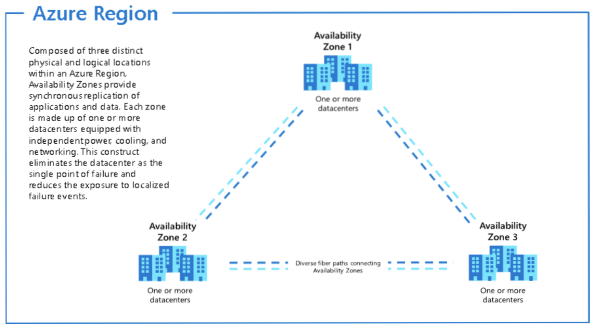

In this blog I'll touch upon the core Azure architectural components like 

- Azure Regions, Availability Zones.
- Subscriptions, Resource Groups, Resources etc.
- Sign up for a free Azure Account
- Access the Azure Portal

Let's start with Azure Docs [Home Page](Azure Docs Main Page https://docs.microsoft.com/en-us/azure/?product=featured#pivot=products&panel=all). This page will give you a detailed overview of all the services available in Azure.

##**Azure Regions and Availability Zones**

**Region:** is a geographical area on the planet that contains at least one but potentially multiple datacenters that are nearby and networked together with a low-latency network. Pls refer to [Azure Regions map](https://azure.microsoft.com/en-us/global-infrastructure/geographies/){:target="_blank"}

**Availability Zones** are physically separate datacenters within an Azure region. Each availability zone is made up of one or more datacenters equipped with independent power, cooling, and networking. An availability zone is set up to be an isolation boundary. If one zone goes down, the other continues working. Availability zones are connected through high-speed, private fiber-optic networks. Pls refer to the [Azure Availability Zones](https://docs.microsoft.com/en-us/azure/availability-zones/az-region) map

